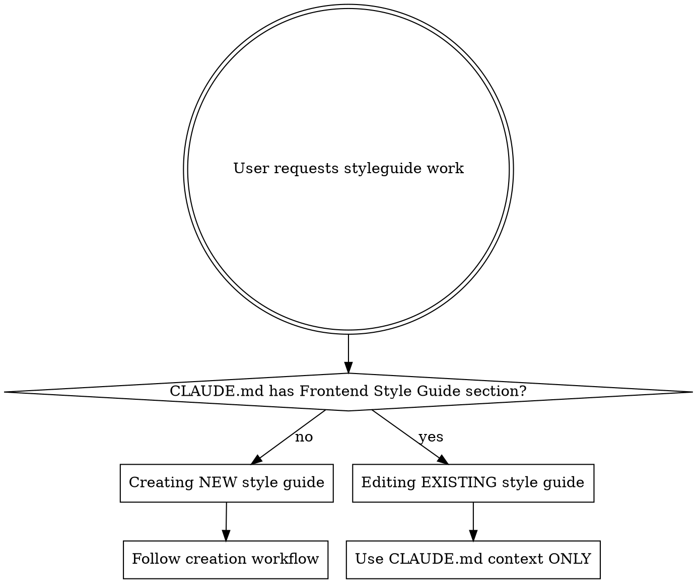
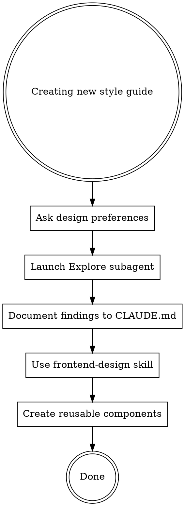

# Generating Frontend Styleguides

## Overview

A frontend styleguide is a living document that defines visual patterns, component APIs, and reusable code for a web project. This skill ensures you create comprehensive, efficient styleguides without wasting context on repeated exploration.

**Core principle:** Explore once with subagent, document findings permanently to CLAUDE.md, never explore again.

## When to Use

Use this skill when the user asks to:
- "Create a style guide"
- "Document our component library"
- "Build a design system"
- "Make reusable components"
- "Standardize our frontend patterns"
- "Update the style guide"
- "Add a component to the style guide"
- "Edit existing components"

## First: Creating vs Editing Decision



**CRITICAL RULE:** If CLAUDE.md already has a "Frontend Style Guide" section, you are EDITING. Do NOT re-explore. Use only the documented context in CLAUDE.md.

## Creation Workflow (New Style Guides Only)



## Editing Workflow (Existing Style Guides)

**When CLAUDE.md already has a "Frontend Style Guide" section:**

1. **Read CLAUDE.md ONLY** - All context you need is already documented
2. **Use frontend-design skill** - Before creating new components
3. **Create/update components** - Using existing patterns from CLAUDE.md
4. **Update CLAUDE.md** - Add new component to inventory

**NEVER:**
- Re-run Explore subagent when editing
- Use Grep/Glob to "check for changes"
- Read unnecessary files
- "Verify" the documented structure

**Why:** You already explored once and documented everything. Re-exploring wastes context. Trust the CLAUDE.md documentation.

### Step 1: Ask Design Preferences FIRST

**Before any exploration**, ask the user these questions using AskUserQuestion:

1. **Design System/Framework:**
   - "Which design system or framework should we follow?"
   - Options: shadcn/ui, Material UI, Bootstrap, Tailwind CSS, Custom, Other
   - Include description of what each provides

2. **Typography:**
   - "Should we include custom fonts?"
   - Options: Use Google Fonts, Use system fonts only, User will specify fonts, Other
   - If Google Fonts selected, ask which font families

3. **Additional Components (optional):**
   - "Are there any specialized components beyond standard UI elements you need?"
   - Let user list any domain-specific components (charts, calendars, specialized inputs)

**CRITICAL:** Do NOT skip these questions. Design system choice affects everything.

### Step 2: Launch Explore Subagent

**REQUIRED:** Use Task tool with `subagent_type: "Explore"`.

**Never use direct Glob/Grep for codebase exploration.** The Explore agent is 50-100x more context-efficient.

**Exploration parameters:**
```
Task tool with:
- subagent_type: "Explore"
- thoroughness: "medium"
- prompt: "Explore the frontend codebase structure. Find:
  1. Component directory structure
  2. Styling methodology (CSS modules, Tailwind, styled-components, etc.)
  3. Existing component patterns and naming conventions
  4. Any existing design tokens or theme configuration
  5. Build tooling and framework (React, Vue, etc.)

  EXCLUDE: node_modules, dist, build, .next, out, coverage, any installation/executable directories

  Summarize findings in a structured format."
```

**Why Explore subagent:** Saves 50-100x context vs running multiple Glob/Grep commands yourself.

### Step 3: Document Findings to CLAUDE.md

**IMMEDIATELY** after Explore completes, write findings to `.claude/CLAUDE.md` in a dedicated section:

```markdown
## Frontend Style Guide

### Project Structure
[Component directories, file organization]

### Styling Approach
[CSS methodology, design tokens, theme system]

### Existing Patterns
[Component patterns, naming conventions]

### Design System
[Framework: shadcn/ui / Material UI / etc.]
[Fonts: Google Fonts - Roboto, Open Sans / System fonts]

### Component Inventory
#### Standard Components
- Button (variants: primary, secondary, outline)
- Input (text, email, password, textarea)
- Card (basic, with header, with actions)
- Modal (dialog, drawer, alert)
- Navigation (navbar, sidebar, tabs)
[etc.]

#### Custom Components
[Any domain-specific components]
```

**Why document to CLAUDE.md:** This becomes permanent project context. You'll never need to re-explore. Future sessions load this instantly.

### Step 4: Use frontend-design Skill

**REQUIRED:** Before creating any components, invoke the frontend-design skill:

```
Skill tool with:
- skill: "frontend-design:frontend-design"
```

The frontend-design skill ensures:
- Distinctive, production-grade aesthetics
- Proper accessibility patterns
- Modern, polished implementation
- Avoids generic AI aesthetics

**Do not create components without using this skill.** It's the difference between generic and professional.

### Step 5: Create Reusable Component Functions

Components must be **functions that can be reused**, not just documentation.

**Structure per component:**

```javascript
/**
 * Button Component
 *
 * @param {Object} props
 * @param {'primary'|'secondary'|'outline'} props.variant - Button style variant
 * @param {'sm'|'md'|'lg'} props.size - Button size
 * @param {boolean} props.disabled - Disabled state
 * @param {React.ReactNode} props.children - Button content
 * @param {Function} props.onClick - Click handler
 * @returns {React.ReactElement}
 */
export function Button({
  variant = 'primary',
  size = 'md',
  disabled = false,
  children,
  onClick
}) {
  // Implementation using design system specified
}
```

**Save to:** `src/components/` or existing component directory (match project structure).

**Update CLAUDE.md** with component location and usage after creation.

## Standard Components (Include by Default)

Unless user specifies otherwise, include these common UI components:

**Form Elements:**
- Button (primary, secondary, outline, ghost variants)
- Input (text, email, password, number)
- Textarea
- Select/Dropdown
- Checkbox
- Radio buttons
- Switch/Toggle

**Layout:**
- Container
- Card
- Grid
- Stack/Flex

**Navigation:**
- Navbar
- Sidebar
- Tabs
- Breadcrumbs

**Feedback:**
- Alert/Toast
- Modal/Dialog
- Tooltip
- Loading spinner
- Progress bar

**Data Display:**
- Table
- Badge
- Avatar
- Divider

**User requested only:** Charts, calendars, specialized domain components.

## File Organization

**Component files:** `src/components/[ComponentName]/` or project's existing structure

**Style guide documentation:** `.claude/CLAUDE.md` (section: "Frontend Style Guide")

**Component demos (if requested):** Create separate demo file or Storybook stories

**Never create in root directory.** Match existing project structure.

## Common Mistakes

| Mistake | Reality |
|---------|---------|
| "I'll just grep for components quickly" | Explore subagent is faster and uses 50-100x less context |
| "I'll document later" | Document to CLAUDE.md immediately or you'll waste context re-exploring |
| "User knows what design system they want" | Always ask explicitly. Assumptions lead to rework |
| "Standard components are obvious" | Your standard ≠ their standard. Check existing codebase |
| "I'll create generic components first" | Use frontend-design skill for professional quality |
| "I can skip fonts question" | Font choice affects entire design. Always ask |
| "I should re-explore to verify changes" | CLAUDE.md is the source of truth. Never re-explore when editing |
| "Let me check the codebase for updates" | If editing, use only CLAUDE.md context. No file reads needed |

## Red Flags - STOP and Follow Workflow

These thoughts mean you're cutting corners:

**When Creating:**
- "Let me just grep the components directory"
- "I'll explore manually instead of using subagent"
- "I'll remember the findings, no need to document"
- "I'll assume they want Material UI"
- "Standard buttons are simple, I'll skip frontend-design"
- "I don't need to ask about fonts"
- "I'll document after I create components"

**When Editing:**
- "Let me re-explore to see what changed"
- "I should verify the structure with Glob"
- "Let me read the component files to check patterns"
- "I'll just quickly grep to confirm"
- "Maybe the CLAUDE.md documentation is outdated"

**All of these mean: Stop. Follow the correct workflow (Creating vs Editing).**

## Exclusions (Never Explore)

**ALWAYS exclude these from exploration:**
- `node_modules/`
- `dist/`, `build/`, `out/`, `.next/`
- `coverage/`, `.coverage/`
- `__pycache__/`, `.pytest_cache/`
- Any installation or executable directories
- `.git/`

**Why:** Wastes context, no useful information for style guides.

## Quality Checklist

**For Creating New Style Guide:**
- [ ] Checked if CLAUDE.md has existing "Frontend Style Guide" section (if yes, you're editing not creating)
- [ ] Asked about design system (shadcn/ui, Material UI, Bootstrap, Tailwind, etc.)
- [ ] Asked about fonts (Google Fonts vs system fonts)
- [ ] Used Explore subagent (not direct Glob/Grep)
- [ ] Documented findings to `.claude/CLAUDE.md` immediately
- [ ] Used frontend-design skill before creating components
- [ ] Created reusable component functions (not just docs)
- [ ] Included all standard components (or confirmed with user)
- [ ] Updated CLAUDE.md with component locations

**For Editing Existing Style Guide:**
- [ ] Confirmed CLAUDE.md has "Frontend Style Guide" section
- [ ] Read CLAUDE.md section ONLY (did not re-explore)
- [ ] Did NOT use Explore, Glob, or Grep to "verify"
- [ ] Used frontend-design skill before creating new components
- [ ] Created/updated components using patterns from CLAUDE.md
- [ ] Updated CLAUDE.md component inventory with new additions

## The Bottom Line

**Explore once. Document permanently. Create professionally.**

Style guides fail when you:
1. Waste context re-exploring because you didn't document
2. Create generic components because you skipped frontend-design
3. Build wrong components because you assumed instead of asked

Follow this workflow to avoid all three.
