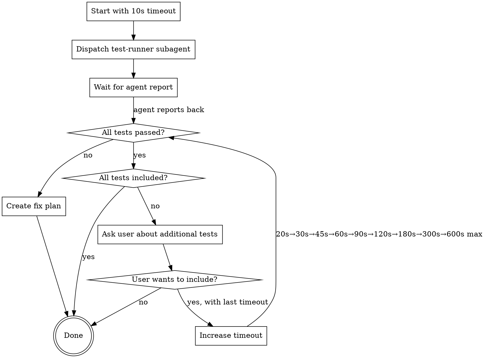

# Test Execution Manager

## Overview

**Core principle:** Delegate test execution to test-runner subagents. Start with short timeouts and escalate incrementally as tests pass. Never exceed 10-minute hard limit.

## When to Use

Use when:
- Running tests via test-runner subagents
- Test suite has variable execution times
- Need to show progress quickly while handling slow tests
- Working within timeout constraints

Do NOT use when:
- Running tests directly (not via subagent)
- Test suite is consistently fast (< 5 seconds)

## Workflow



## Incremental Timeout Escalation

**Start small, escalate as tests pass:**

| Iteration | Timeout | Use When |
|-----------|---------|----------|
| 1 | 10s | Initial run - fast unit tests |
| 2 | 20s | If all passed, try more tests |
| 3 | 30s | Continue escalating |
| 4 | 45s | Medium integration tests |
| 5 | 60s | Longer integration tests |
| 6 | 90s | Slow integration tests |
| 7 | 120s | E2E tests |
| 8 | 180s | Comprehensive suites |
| 9 | 300s | Very large suites |
| 10 | 600s | **HARD LIMIT - never exceed** |

**Escalation rules:**
- Only escalate if ALL tests passed in current timeout
- If tests fail, create fix plan (don't escalate)
- If timeout exceeded but no failures, investigate (may need different test selection)

## Critical Rules

**DO:**
- Dispatch test-runner subagent for test execution
- Wait for agent to report back (don't read terminal output directly)
- Start with 10-second timeout
- Verify all intended tests were included before reporting completion
- Ask user before including additional out-of-scope tests
- Create a plan to fix failures (don't just list them)

**DO NOT:**
- Read terminal output that test-runner manages (wait for agent report)
- Start with "safe" large timeout (defeats incremental strategy)
- Exceed 10-minute (600-second) timeout under any circumstances
- Report completion without verifying test inclusion
- Run more than 1 Explore agent concurrently
- Add tests without user confirmation

## Test Inclusion Verification

After tests pass, verify coverage:

```bash
# Check what pytest would collect
pytest --collect-only tests/

# Count test files
find tests/ -name "test_*.py" | wc -l
```

If tests ran < expected count:
1. Identify missing tests
2. Ask user: "Tests passed, but I found N additional test files. Include these?"
3. If yes: Run with last successful timeout
4. If no: Report completion with current coverage

## Common Mistakes

| Mistake | Fix |
|---------|-----|
| Starting with 2-min timeout "to be safe" | Start with 10s, escalate incrementally |
| Reading pytest output directly | Wait for test-runner agent report |
| Exceeding 10-min limit | Enforce 600s hard cap |
| Auto-including all tests found | Ask user before expanding scope |
| Running multiple Explore agents | Limit to 1 Explore agent at a time |

## Example Interaction

```
User: "Run the tests"

Agent: Dispatching test-runner with 10s timeout...
[test-runner reports: 15 tests passed in 8s]

Agent: Fast tests passed. Found 30 more test files. Include those?
User: Yes

Agent: Running with 20s timeout...
[test-runner reports: 45 tests passed in 18s]

Agent: All tests passed ✓
```

## Rationalization Table

| Rationalization | Reality |
|-----------------|---------|
| "I'll calculate optimal timeout to be efficient" | Start at 10s regardless of estimates. Efficiency is in feedback, not fewer iterations. |
| "User said 'all tests' so I don't need to ask" | User may not know about slow tests. Always confirm before expanding scope. |
| "Tests keep timing out, I'll add more time" | After 300s, investigate root cause. Don't blindly escalate to 600s limit. |
| "Let me check terminal to show progress" | Wait for agent report. Checking terminal violates separation of concerns. |
| "Starting small wastes iterations" | Incremental escalation IS the strategy, not a workaround to optimize away. |

## Red Flags - STOP

These thoughts mean you're violating the workflow:

- "I'll just run everything with 2-min timeout" (start small)
- "Let me check the test output" (wait for agent report)
- "User wants it done, I'll use 15-min timeout" (10-min hard limit)
- "I'll include those tests automatically" (ask first)
- "I know these need 5 minutes, starting at 10s is inefficient" (incremental strategy is mandatory)
- "Tests timing out repeatedly means I need more time" (investigate after 300s)

**All of these mean: Follow incremental workflow above.**
